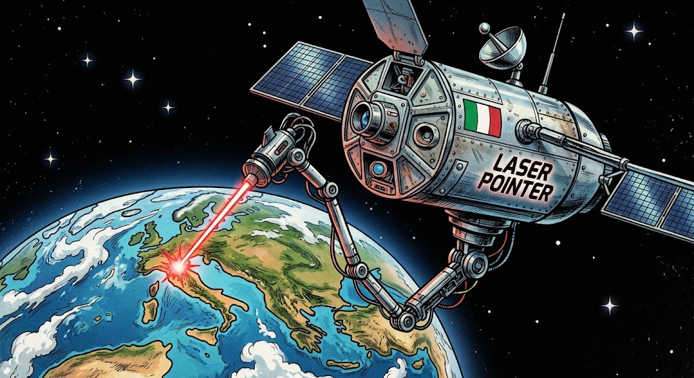
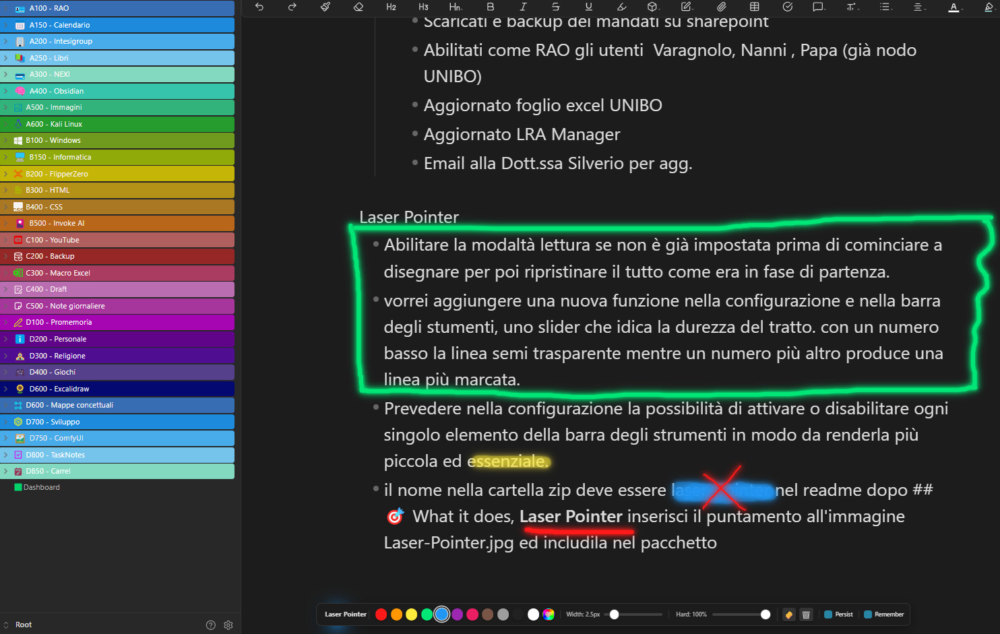

# 🔴 Laser Pointer

**Author:** Alessandro Vettorel  
**Version:** 1.0.1  
**For:** Obsidian (min. v0.16.0)

---

## 🎯 What it does



**Laser Pointer** is an Obsidian plugin designed for anyone who shares their screen, teaches, presents, records videos, or simply wants to **highlight and guide attention** to content inside their notes.



When you are on a call, recording a tutorial, or showing your vault to someone, the laser pointer lets you:
- **Highlight** words, sentences, and key concepts with a glowing dot
- **Draw lines** to connect ideas, circle important elements, or underline text
- **Guide the viewer's eye** without the native mouse cursor getting in the way
- **Annotate freely** with persistent or auto-fading trails
- **Save and resume** your drawings across laser sessions

It is your virtual laser pointer, right inside Obsidian.

---

## ✨ Features

### 1. Glowing laser pointer
A bright, colored dot follows your mouse everywhere. The system cursor is automatically hidden, leaving only the laser visible — clean, professional, and distraction-free.

### 2. Draw trails on the fly
Hold down the **left mouse button** and move: you draw a glowing line that follows your path. Perfect for:
- Underlining text
- Circling concepts
- Tracing connections between ideas
- Highlighting areas of the interface

The text underneath is **never selected** while you draw, so your notes stay clean.

### 3. Self-fading trails
Release the left button and the line stays visible for a configurable duration, then **fades away slowly** with an elegant fade effect. No manual cleanup needed.

### 4. Persist trails mode
Enable **"Persist"** from the floating toolbar. When active, every line you draw **stays on screen permanently** until you exit laser mode. Ideal for building up a full diagram, annotation layer, or complex illustration during a presentation.

### 5. Remember drawings
Enable **"Remember"** from the floating toolbar or settings. When active, all your drawn trails are **saved when you exit laser mode** and **automatically restored** when you re-enter. Perfect for resuming a presentation or tutorial without redrawing everything.

### 6. Auto reading mode
When activated, the plugin can **automatically switch the current note to reading mode** so you can draw freely without entering edit mode. When you turn the laser off, the original mode is restored.

### 7. Quick deactivation
Turn the laser off instantly using any of these methods:
- **Right-click** anywhere on the screen
- Press the **ESC** key on your keyboard
- Click the **🎯 icon** in the sidebar

No need to hunt for buttons when you are done.

### 8. Floating toolbar (draggable & customizable)
When the laser is on, a **compact horizontal toolbar** appears at the bottom center of the screen. You can **drag it anywhere** by grabbing the header. It gives you instant access to all controls without opening Settings.

You can also **customize which controls appear** on the toolbar from Settings, making it as minimal or as complete as you like.

### 9. 11 preset colors
Switch colors instantly from the toolbar. Available presets:
🔴 Red · 🟠 Orange · 🟡 Yellow · 🟢 Green · 🔵 Blue · 🟣 Purple · 🩷 Pink · 🟤 Brown · ⚪ Gray · ⚫ Black · ⬜ White

### 10. Custom color picker
Click the **🎨** button on the toolbar to open the browser's native color picker and choose any color you want.

### 11. Adjustable trail width
Move the **Width slider** on the toolbar to change the stroke thickness on the fly — from an ultra-thin hairline (0.5 px) up to a bold, heavy stroke (20 px).

### 12. Stroke hardness (opacity)
Move the **Hardness slider** to control how opaque or transparent the trail is:
- **Low** → faint, semi-transparent line (delicate highlights)
- **High** → solid, bold stroke (strong markers)

### 13. Eraser mode
Click the **🧽** button to enter eraser mode. The pointer changes to a ring cursor. Click on any existing trail to delete it individually. Click 🧽 again to return to drawing mode.

### 14. Clear All
Click the **🗑️** button to delete **all** drawn trails instantly — both persistent and saved ones.

### 15. Full settings panel
Go to **Settings → Community Plugins → Laser Pointer** to set your defaults:
- **Laser color** — default color of the pointer and trails
- **Trail width (px)** — default stroke thickness (0.5 to 20 px)
- **Stroke hardness** — opacity of the trail (10% to 100%)
- **Trail duration (seconds)** — how long trails stay visible before fading (1 to 10 seconds)
- **Persist trails** — when on, trails remain until laser mode is exited
- **Remember drawings** — when on, trails are saved and restored across sessions
- **Auto reading mode** — automatically switch to reading mode when laser is on
- **Toolbar visibility** — choose exactly which controls appear on the floating toolbar

All settings are saved automatically.

---

## 🚀 Installation

### Manual

1. Extract the package into a folder on your computer.
2. Open a terminal in that folder and run:
   ```bash
   npm install
   npm run build
   ```
3. Copy the generated files `manifest.json`, `main.js`, and `styles.css` into:
   ```
   .obsidian/plugins/laser-pointer/
   ```
   inside your vault.
4. In Obsidian, go to **Settings → Community Plugins**, find **Laser Pointer**, and enable it.

### Via GitHub Releases (recommended)

Download the latest release from the GitHub releases page and extract the three files (`main.js`, `manifest.json`, `styles.css`) into `.obsidian/plugins/laser-pointer/`.

---

## 🎮 How to use

| Action | Result |
|---|---|
| Click the 🎯 icon in the sidebar | Toggle laser on / off |
| `Ctrl+P` → "Laser Pointer" | Toggle from the Command Palette |
| Move the mouse | The laser dot follows you |
| Hold **left mouse button** | Draw a glowing trail |
| Release the left button | Trail fades after X seconds (or stays if Persist is on) |
| **Right-click** anywhere | Instantly turn the laser off |
| Press **ESC** key | Instantly turn the laser off |
| Drag the **toolbar header** | Move the floating toolbar anywhere |
| Click a **color dot** on the toolbar | Change laser color instantly |
| Click **🎨** on the toolbar | Open the full color picker |
| Move the **Width slider** on the toolbar | Adjust trail thickness live |
| Move the **Hardness slider** on the toolbar | Adjust trail opacity live |
| Check **"Persist"** on the toolbar | Trails stay until you exit laser mode |
| Check **"Remember"** on the toolbar | Trails are saved and restored across sessions |
| Click **🧽** on the toolbar | Enter eraser mode — click trails to delete them |
| Click **🗑️** on the toolbar | Delete all trails at once |

---

## 💡 Use cases

- **Teaching & tutorials** — guide students to key concepts in your notes
- **Work calls** — show colleagues exactly what you are referring to
- **Video & screen recordings** — make your explanations clearer and more dynamic
- **Presentations** — replace a physical laser pointer, directly inside your vault
- **Code / note reviews** — highlight bugs, tasks, or ideas to remember
- **Diagramming on the fly** — enable Persist + Remember to sketch full diagrams that survive across sessions
- **Live annotation** — underline, circle, and connect ideas in real time

---

## 📝 Technical notes

- The plugin uses an SVG overlay with `pointer-events: none`, so it **does not interfere** with normal Obsidian use (clicking links, selecting text, using menus…)
- The mouse cursor is hidden only while the laser is active
- Obsidian's context menu is temporarily disabled in laser mode to allow quick right-click deactivation
- Drawing calls `preventDefault()` so text underneath is never selected while you trace
- The floating toolbar ignores laser drawing events — you can click its buttons safely
- The laser pointer is hidden while dragging the toolbar to avoid visual clutter
- When Persist trails is enabled, all trails are automatically cleared when laser mode is exited (unless Remember drawings is also on)
- Remember drawings saves trail geometry, color, width, opacity, and glow data to disk and restores it on re-entry
- The eraser mode temporarily enables `pointer-events: auto` on the SVG overlay to allow trail selection
- Auto reading mode saves the original view state (source/preview) and restores it on deactivation

---

## 📄 License

MIT
